CONSOLIDACION M7 

LuisTorresGomez.cl@gmail.om

## Etapa 0 : Creando la carpeta del proyecto
```	
mk  practica_final_orm_django
cd    practica_final_orm_django
```	
## Etapa 1: Crear entorno virtual en Python para trabajar con Django.
```	
pip install virtualenvwrapper # En caso de no estar instalado

mkvirtualenv farmaceutico

workon farmaceutico # (para ingresar al entorno, en caso de NO ingresar automaticamente)

```	
#### # Instalando dependencias 
```
pip install django	
pip install psycopg2  # El driver psycopg2 es necesario para que Django pueda comunicarse con PostgreSQL.
```	

## #Etapa 2: Creación del proyecto Django
```

cd  practica_final_orm_django #Ingresando a la carpeta del proyecto en caso para creacion de este

django-admin startproject config .
```


## Etapa 3: Creación de la base de datos y usuario en PostgreSQL
#### #En la consola de SQL shell
```	
psql
Server [localhost]: ENTER
Database [postgres]:ENTER
Port [5432]:ENTER
Username [postgres]:ENTER
Contraseña para usuario postgres: postgresql
```	
```	
CREATE DATABASE db_final_orm;
```	
#### #Cambio de BD
```	
\c db_final_orm;

	CREATE USER userdjango  WITH PASSWORD 'userdjango ';
	ALTER ROLE userdjango  SET default_transaction_isolation TO 'read committed';
	ALTER ROLE userdjango  SET timezone TO 'UTC';
	GRANT ALL PRIVILEGES ON DATABASE db_final_orm TO userdjango;
	GRANT ALL PRIVILEGES ON SCHEMA public TO userdjango; #Sin esta sentencia "mensaje error de Permiso denegado"
	ALTER ROLE userdjango SET search_path TO public;
```	
#### #Diferencias de sentencias "GRANT"

    "GRANT ALL PRIVILEGES ON SCHEMA public TO userdjango":
Otorga todos los privilegios sobre el esquema "public" específicamente.
Permite al usuario realizar operaciones como crear, modificar y eliminar objetos (tablas, vistas, funciones, etc.) dentro del esquema public.
No otorga privilegios a nivel de base de datos.

```	
"GRANT ALL PRIVILEGES ON DATABASE db_final_orm TO userdjango":
```	
Otorga todos los privilegios a nivel de la base de datos "db_final_orm".
Incluye privilegios como:
CREATE: Permite crear nuevos esquemas y publicaciones en la base de datos.
CONNECT: Permite al usuario conectarse a la base de datos.
TEMPORARY: Permite crear tablas temporales en la base de datos.
No otorga automáticamente privilegios sobre objetos específicos dentro de los esquemas de la base de datos.


#### #Configurar la base de datos en settings.py (del proyecto)
```	
DATABASES = {
    'default': {
        'ENGINE': 'django.db.backends.postgresql',
        'NAME': 'db_final_orm',  # Nombre de tu base de datos
        'USER': 'userdjango',          # Usuario creado en PostgreSQL
        'PASSWORD': 'userdjango',      # Contraseña del usuario
        'HOST': 'localhost',           # Dirección del servidor de la base de datos
        'PORT': '',                    # Puerto (vacío usa el predeterminado: 5432)
    }
}
```	

#### #En CMD del proyecto verificar que Django puede conectarse a PostgreSQL:
```	
python manage.py check 
System check identified no issues (0 silenced). #Significa esta ok la conexion
```	

## #Etapa 4: Crear y Registrar la aplicación laboratorio en settings.py
#### #CREAR la aplicación en CMD del proyecto
```	
python manage.py startapp laboratorio

```	
#### #REGISTRAR la aplicación en settings.py

```	
INSTALLED_APPS = [
    ...
    'laboratorio',
]

```	


## #Etapa 5: Creación de los MODELOS en laboratorio/models.py:

```	
from django.db import models
from django.core.validators import MinValueValidator
from django.utils import timezone

class Laboratorio(models.Model):
    nombre = models.CharField(max_length=100)

    def __str__(self):
        return self.nombre

class DirectorGeneral(models.Model):
    nombre = models.CharField(max_length=100)
    laboratorio = models.OneToOneField(Laboratorio, on_delete=models.CASCADE, related_name='director')

    def __str__(self):
        return self.nombre

class Producto(models.Model):
    nombre = models.CharField(max_length=100)
    laboratorio = models.ForeignKey(Laboratorio, on_delete=models.CASCADE, related_name='productos')
    f_fabricacion = models.DateField(validators=[MinValueValidator(limit_value=timezone.datetime(2015, 1, 1).date())])
    p_costo = models.DecimalField(max_digits=10, decimal_places=2)
    p_venta = models.DecimalField(max_digits=10, decimal_places=2)

    def __str__(self):
        return self.nombre
```	
#### #Explicacion de las relaciones

* laboratorio = models.OneToOneField(Laboratorio, on_delete=models.CASCADE, related_name='director')
    
    * Este comando crea una relación uno a uno entre dos modelos:
        * OneToOneField: Establece una relación uno a uno con el modelo Laboratorio.
        * Laboratorio: Es el modelo al que se está relacionando.
        * on_delete=models.CASCADE: Indica que si se elimina el Laboratorio relacionado, también se eliminará este objeto.
        * related_name='director': Permite acceder a este objeto desde el Laboratorio relacionado usando laboratorio.director.

* laboratorio = models.ForeignKey(Laboratorio, on_delete=models.CASCADE, related_name='productos')

    * Este comando crea una relación muchos a uno:
        * ForeignKey: Establece una relación muchos a uno con el modelo Laboratorio.
        * Laboratorio: Es el modelo al que se está relacionando.
        * on_delete=models.CASCADE: Similar al anterior, si se elimina el Laboratorio, se eliminarán todos los objetos relacionados.
        * related_name='productos': Permite acceder a los objetos relacionados desde el Laboratorio usando laboratorio.productos.

* f_fabricacion = models.DateField(validators=[MinValueValidator(limit_value=timezone.datetime(2015, 1, 1).date())])

    * Este comando crea un campo de fecha con una validación:
        * DateField: Define un campo para almacenar fechas.
        * validators: Lista de validadores para este campo.
        * MinValueValidator: Valida que la fecha sea mayor o igual a un valor mínimo.
        * limit_value=timezone.datetime(2015, 1, 1).date(): Establece el 1 de enero de 2015 como la fecha mínima permitida

#### # Explicacion related_names en la relacioness

Relacion "ForeignKey"
La elección de 'productos' como related_name tiene las siguientes implicaciones:
Permite acceder a los productos relacionados desde una instancia de Laboratorio de forma más intuitiva. Por ejemplo:
laboratorio.productos.all()
Es una forma plural del modelo actual (Producto), lo cual es una convención común al nombrar related_names.
Describe claramente la relación inversa: un laboratorio tiene múltiples productos.
Evita el nombre por defecto que sería 'producto_set', haciendo el código más legible.
Facilita las consultas inversas, permitiendo obtener todos los productos de un laboratorio de manera más natural.

Relacion "OneToOneField"
Cada instancia del modelo Laboratorio solo puede tener un único director asociado. Por lo tanto, tiene más sentido usar el singular "director" para reflejar esta relación uno a uno.


## #Etapa 6: Migraciones y Creación del Superusuario:
```
python manage.py makemigrations #Crear nuevas migraciones basadas en los cambios detectados en tus modelos, sin aplicarlos aún.

python manage.py migrate #Ejecuta las migraciones pendientes

python manage.py createsuperuser --username=admin --email=admin@correo.cl  #Crea un superusuario para el panel de administración de Django.
```

## #Etapa 7: Esquema de las bases de datos
#### #en la consola de PSQL
Tablas correspondientes a los modelos de Django:
```
	\dt
```	

####  Tablas correspondientes a los modelos de Django
* laboratorio_laboratorio
* laboratorio_directorgeneral
* laboratorio_producto

### Estructura de las tablas

 #### Modelo Laboratorio
 ```
	 \d laboratorio_laboratorio
```	
 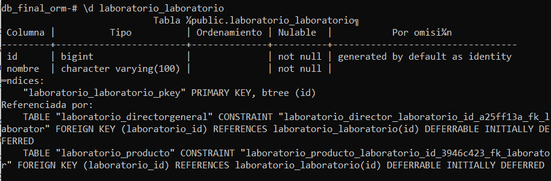

 #### Modelo Director

 Relación Uno a Uno  
 Entre Laboratorio y DirectorGeneral:

 ```
	\d laboratorio_directorgeneral
```	
 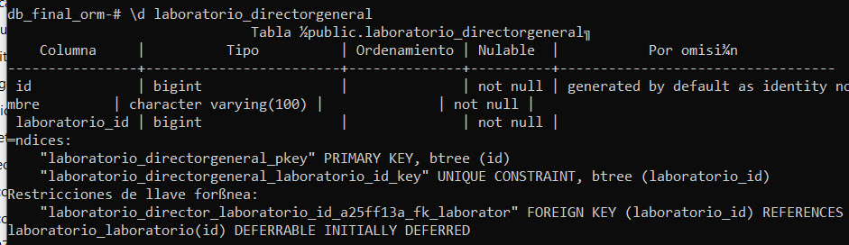

 #### Modelo Producto

 Relación Uno a Muchos  
 Entre Laboratorio y Producto:

 ```
	\d laboratorio_producto
```	
 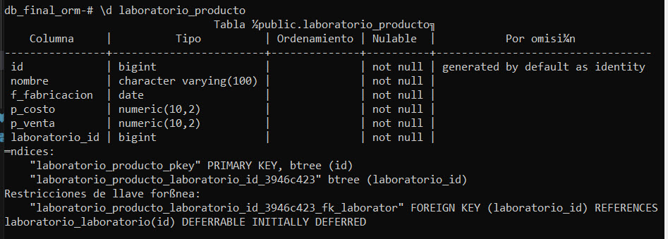


## #Etapa 8: Configuración del Sitio Administrativo
#### #Registrando los Modelos, en laboratorio/admin.py

```	
from django.contrib import admin
from .models import Laboratorio, DirectorGeneral, Producto

@admin.register(Laboratorio)
class LaboratorioAdmin(admin.ModelAdmin):
    list_display = ('nombre',)

@admin.register(DirectorGeneral)
class DirectorGeneralAdmin(admin.ModelAdmin):
    list_display = ('nombre', 'laboratorio')

@admin.register(Producto)
class ProductoAdmin(admin.ModelAdmin):
    list_display = ('nombre', 'laboratorio', 'f_fabricacion', 'p_costo', 'p_venta')
    list_filter = ('laboratorio',)
    search_fields = ('nombre',)
```	

### # EXPLICANDO SINTAXIS DEL BLOQUE
 ```
from .models import Laboratorio, DirectorGeneral, Producto
 ```
* Permite que Django sepa qué modelos debe registrar en el panel de administración

#### El registro del Modelo y Crear clase para agregar campos

 ```
@admin.register(Laboratorio)
class LaboratorioAdmin(admin.ModelAdmin):
    list_display = ('nombre',)  #Cuando es un solo campo se debe colocar la "," para que se mantenga el parentesis y no de error.
 ```

* @admin.register(Laboratorio): Decorador que registra el modelo en el admin
* class LaboratorioAdmin(admin.ModelAdmin): Define una clase que hereda de ModelAdmin
* list_display = ('nombre',): Especifica qué campos se mostrarán en la lista del admin

#### En este caso que debo usar campo de filtro y de busqueda
 ```
@admin.register(Producto)
class ProductoAdmin(admin.ModelAdmin):
    list_display = ('nombre', 'laboratorio', 'f_fabricacion', 'p_costo', 'p_venta')
    list_filter = ('laboratorio', 'nombre')
    search_fields = ('nombre', 'laboratorio__nombre')

 ```
Para list_filter:
Se usan campos que tienen un número limitado de opciones o relaciones
En este caso, laboratorio es un buen candidato porque:
Es una ForeignKey que relaciona con el modelo Laboratorio
Permite filtrar productos por laboratorio específico
Muestra una lista desplegable con todos los laboratorios disponibles

Para search_fields:
Se usan campos de texto que necesitan búsqueda libre
En este caso, nombre es apropiado porque:
Es un CharField que contiene texto
Los usuarios necesitan buscar productos por nombre
Permite búsquedas parciales o completas del nombre


Este bloque permite:
Filtrar por dos campos: laboratorio y nombre
Buscar tanto por el nombre del producto como por el nombre del laboratorio relacionado (usando laboratorio__nombre)

### #Verificar los modelos en Sitio Administrativos

### LABORATORIOS
 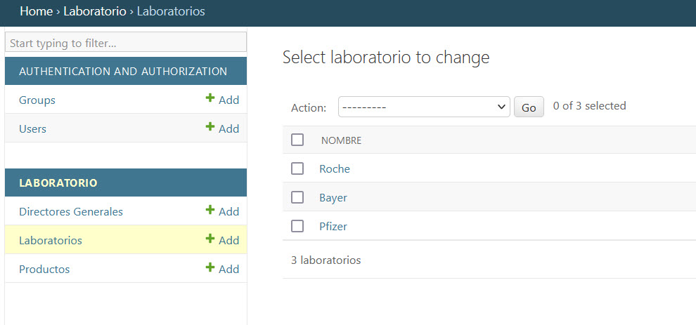
### DIRECTORES GENERALES
 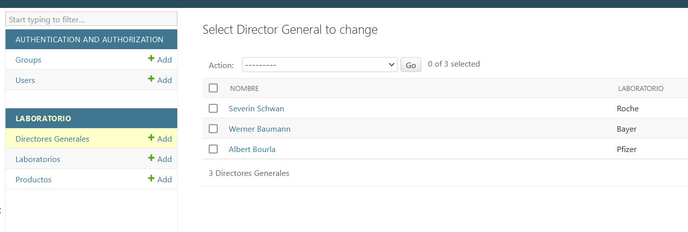
### PRODUCTOS, MAS FILTROS Y BUSQUEDA
 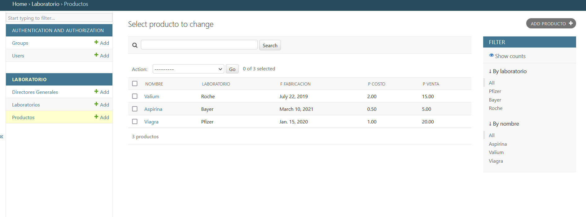


### Shell de python se realiza las sgte consultas:

#### #Obtenga todos los objetos tanto Laboratorio, DirectorGeneral y Productos.
 ```
Laboratorio.objects.all()
 ```

 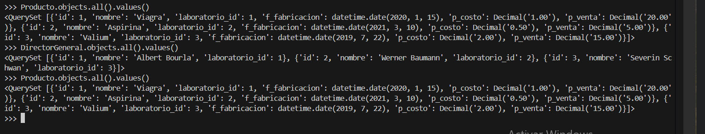


#### #Obtenga el laboratorio del Producto cuyo nombre es ‘Producto 1’.
```
Producto.objects.get(id=1).laboratorio
```
 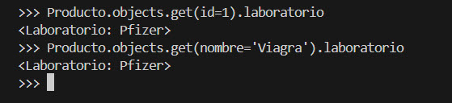


#### #Ordene todos los productos por nombre, y que muestre los valores de nombre y laboratorio.
```
Producto.objects.order_by('nombre').values('nombre', 'laboratorio__nombre')
```
 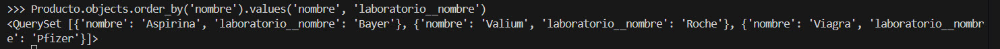


#### #Realice una consulta que imprima por pantalla los laboratorios de todos los productos
```
for producto in Producto.objects.all():
    print(f"{producto.nombre}: {producto.laboratorio.nombre}")

```
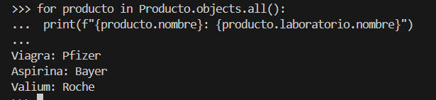


## #Etapa 9: Modificar los modelos en laboratorio/models.py:


 ```
class Laboratorio(models.Model):
    nombre = models.CharField(max_length=100)
    ciudad = models.CharField(max_length=100) # agregado
    pais = models.CharField(max_length=100) # agregado

class DirectorGeneral(models.Model):
    nombre = models.CharField(max_length=100)
    laboratorio = models.OneToOneField(Laboratorio, on_delete=models.CASCADE, related_name='director')
    especialidad = models.CharField(max_length=100) # agregado
 ```


 #### #Crear la migración:
 ```
python manage.py makemigrations laboratorio --name actualizado_campos
 ```
#### #Aplicar la migración:
 ```
python manage.py migrate
 ```
#### #Mostrar todas las migraciones:
 ```
python manage.py showmigrations laboratorio
 ```

#### MIGRACIONES REALIZADAS
 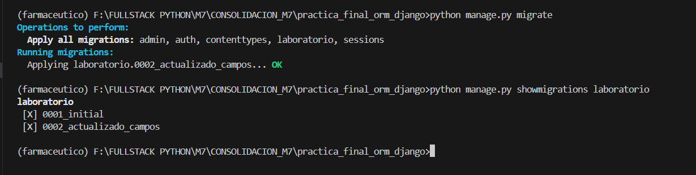


## #Etapa 10: Crud y Vistas

#### # Vista "Listado de Laboratorios" en raiz "127.0.0.1:8000"

 

#### # Vista "NUEVO Laboratorio" en raiz "127.0.0.1:8000/new/"

 

 #### # Vista "DETALLE Laboratorio" (aparece despues de crear un laboratorio)


#### # Vista "ACTUALIZAR Laboratorio" 

 

#### # Vista "ELIMINAR Laboratorio" 

 


## #Etapa 11: Pruebas Unitarias

  Se crea un archivo **laboratorio/test.py** para ejecutar el script de las pruebas unitarias:

**Pero antes se tuvo que agregar un permiso al usuario en PSQL, porque denegaba el permiso al ejcutar las prueba unitarias**

#### #Esto otorga al usuario userdjango permiso para crear bases de datos.
```
db_final_orm=# ALTER USER userdjango CREATEDB;
```
#### #Verificar que el usuario tiene el permiso
```
\du userdjango
```
#### #Procedemos ejecutar las pruebas unitarias

```
  python manage.py test laboratorio
```
#### Que hace este script
* Modelo (LaboratorioModelTest):
    *   test_laboratorio_content:
        * Verifica que los campos del modelo Laboratorio contengan los valores esperados.
        * Mensaje: "✔ Modelo: test_laboratorio_content pasó correctamente. Los campos 'nombre', 'ciudad' y 'pais' tienen los valores esperados."
* Vistas (LaboratorioViewTest):
    * test_view_url_exists_at_desired_location:
        * Verifica que la URL / sea accesible.
        * Mensaje: "✔ Vista: test_view_url_exists_at_desired_location pasó correctamente. La URL '/' es accesible (status code 200)."
    * test_view_url_accessible_by_name:
        * Verifica que la vista sea accesible usando el nombre de la URL laboratorio_list.
        * Mensaje: "✔ Vista: test_view_url_accessible_by_name pasó correctamente. La vista 'laboratorio_list' es accesible por su nombre."
    * test_view_uses_correct_template:
        * Verifica que se esté utilizando el template correcto (laboratorio_list.html) para renderizar la vista.
        * Mensaje: "✔ Vista: test_view_uses_correct_template pasó correctamente. Se está usando el template 'laboratorio_list.html'."
    * test_list_all_laboratorios:
        * Verifica que la lista de laboratorios devuelva todos los registros creados.
        * Mensaje: "✔ Vista: test_list_all_laboratorios pasó correctamente. La lista contiene todos los laboratorios creados."

        #### Resultado pruebas unitarias
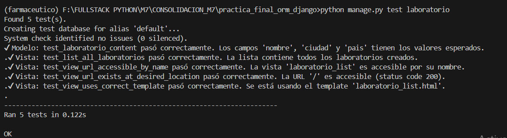
